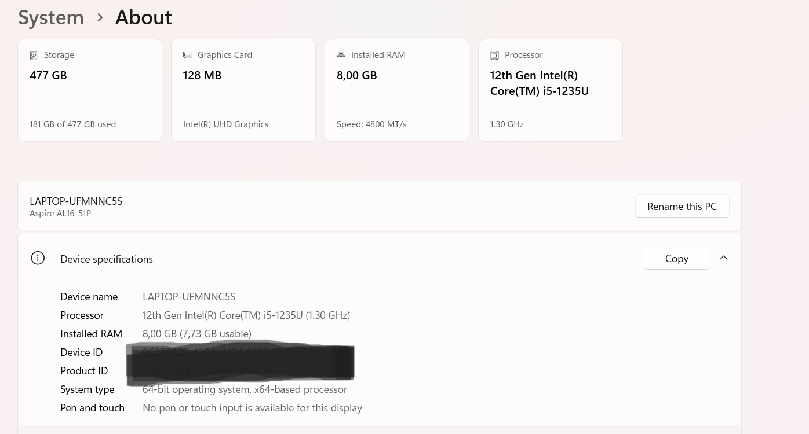
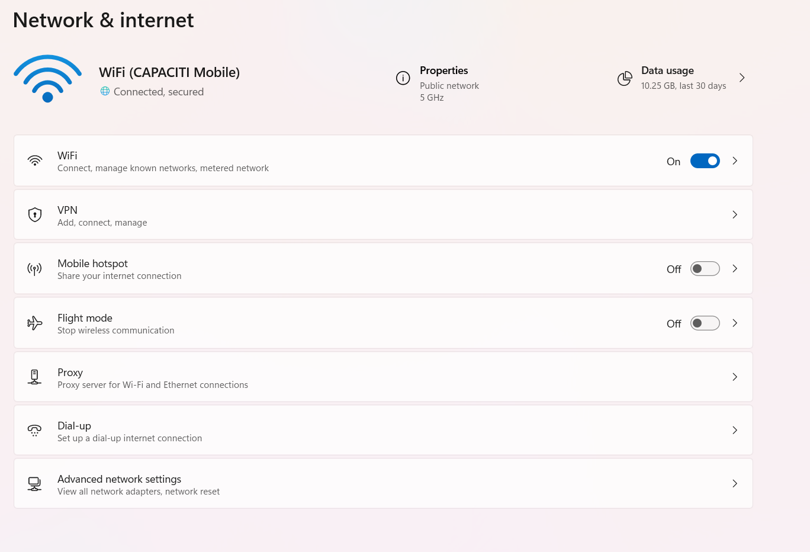
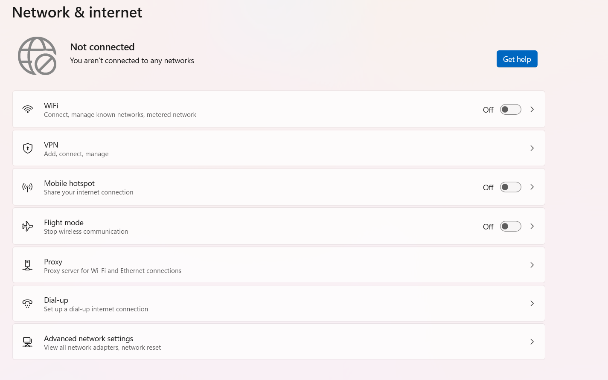
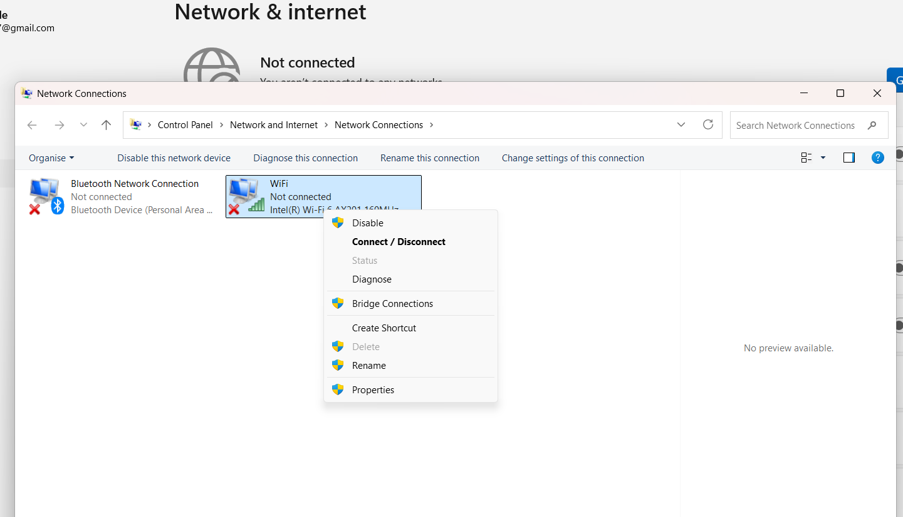
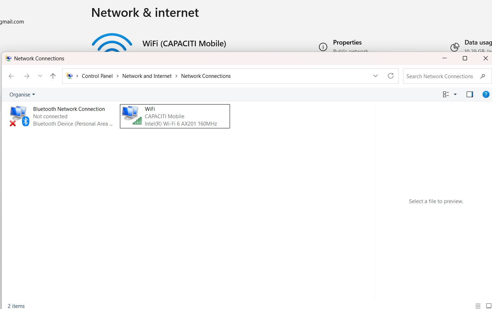

# Technical-Support-Fundamentals

# IT Support Practical Report – Technical Support Fundamentals

**Name:** Galaletsang Mokgele
**Date:** 10 February 2026
**System Used:** Windows

---

## #1 System Specifications
- **Processor (CPU):** 12th Gen Intel(R) Core(TM) i5-1235U (1.30 GHz)
- **RAM:** 8.00 GB (7.73 GB usable)
- **Windows Version:** Windows 11, 64-bit
- **Screenshot:** 
*Shows the laptop’s processor, RAM, storage, OS, and graphics.*

---

## #2 Network Status (Before Issue)
- **Network Type:** Wi-Fi
- **IP Address:** 192.168.1.5 *(example; check your own using `ipconfig`)*
- **Connection Status:** Connected
- **Test Performed:** `ping google.com`
- **Result:** Successful replies
- **Screenshot:** 
*Shows Wi-Fi connected, IP address assigned, and successful ping.*

---

## #3 Simulated Issue
- **Issue Chosen:** Internet Disconnection
- **How it Appeared:** Wi-Fi turned off / disconnected, ping failed
- **Screenshot:** 
*Shows internet disconnected and ping test failing.*

---

## #4 Troubleshooting Step 1
- **Step:** Disabled the network adapter to reset connection
- **Screenshot:** 
*Shows network adapter being disabled to reset the connection.*

---

## #5 Troubleshooting Step 2
- **Step:** Enabled the network adapter to restore connection
- **Screenshot:** !https://github.com/GMaureen/Technical-Support-Fundamentals/blob/2121a25d431fdd6fff22a3c5d9dcd5b8a01d189f/Figure5_Trableshooting_Step2.png
*Shows network adapter re-enabled and ready to reconnect.*

---

## #6 Resolution
- **How the issue was fixed:** Adapter reset restored IP and connection
- **Result after fix:** Internet working, ping successful
- **Screenshot:** 
*Shows Wi-Fi connected, IP restored, and successful ping.*

---

## #7 Observations / Notes
- I learned how to check system specifications.
- I learned how to test network connectivity.
- I learned how to simulate a network issue.
- I learned how to troubleshoot using the network adapter reset method.
- These steps helped me understand basic IT support procedures.
- I learned how small actions can solve common connectivity problems.
