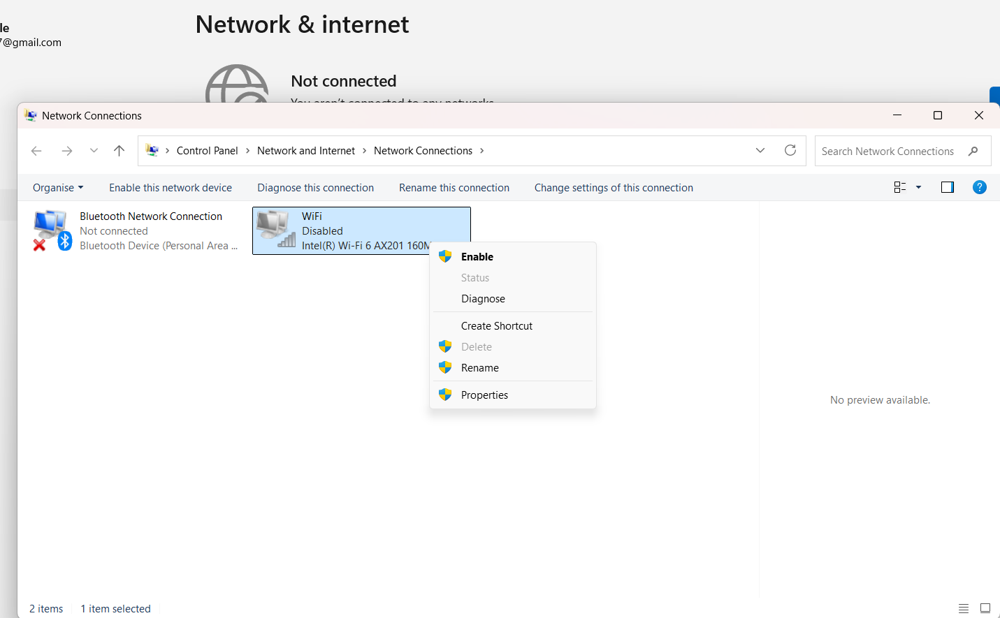

# Technical-Support-Fundamentals

## #1 System Specifications

- **Processor (CPU):** 12th Gen Intel(R) Core(TM) i5-1235U (1.30 GHz)  

- **RAM:** 8.00 GB (7.73 GB usable)  

- **Windows Version:** Windows 11, 64-bit  

- **Screenshot:** 

---

## #2 Network Status (Before Issue)

- **Network Type:** Wi-Fi  

- **IP Address:** 192.168.1.5 *  

- **Connection Status:** Connected  

- **Test Performed:** `ping google.com`  

- **Result:** Successful replies  

- **Screenshot:** 

---

## #3 Simulated Issue

- **Issue Chosen:** Internet Disconnection  

- **How it Appeared:** Wi-Fi turned off / disconnected, ping failed  

- **Screenshot:** 

---

## #4 Troubleshooting Step 1

- **Step:** Disabled the network adapter to reset connection  

- **Screenshot:** 

---

## #5 Troubleshooting Step 2

- **Step:** Enabled the network adapter to restore connection  

- **Screenshot:** 

---

## #6 Resolution

- **How the issue was fixed:** Adapter reset restored IP and connection  

- **Result after fix:** Internet working, ping successful  

- **Screenshot:** 

---

## #7 Observations / Notes

> I learned how to check system specifications, test network connectivity, simulate a network issue,
> and troubleshoot using the network adapter reset method. These steps helped me understand basic IT support procedures
> and how small actions can solve common connectivity problems.
